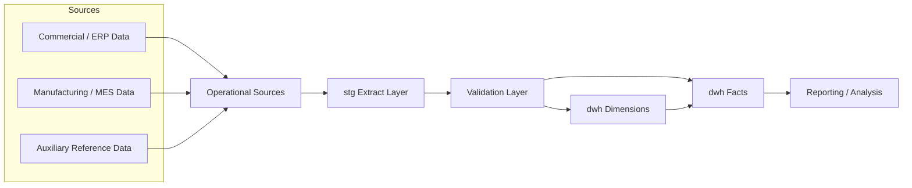
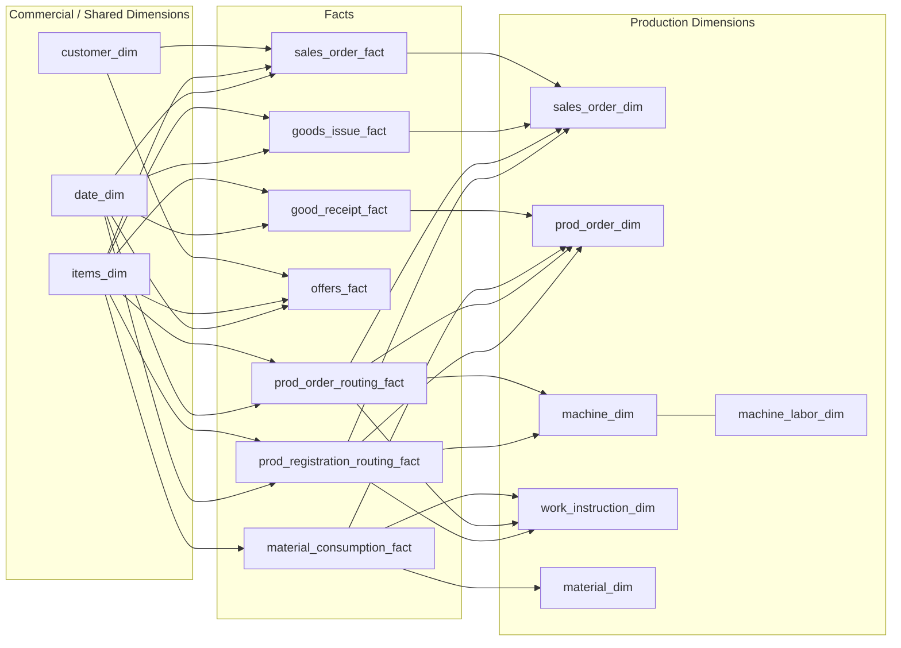

# SQL Server Manufacturing DWH Case Study

End-to-end case study of designing and implementing a SQL Server data warehouse for manufacturing and commercial analytics.

This repository is a sanitized portfolio version of a real project I built from scratch to turn operational SQL Server data into a stable analytical model with:
- staging extracts
- SCD1 and SCD2 dimensions
- conformed fact tables
- SQL Agent orchestration
- lightweight production validation

## Project Summary

The core challenge was not just writing SQL queries. It was designing a warehouse that could sit between imperfect operational systems and repeatable business reporting.

The source landscape contained:
- multiple operational domains
- mixed snapshot and historical logic
- inconsistent business naming
- ambiguous grain in some production datasets
- both current-state and time-aware entities

The solution was a layered SQL Server warehouse:
- `stg` for source-aligned extracts
- `dwh` for dimensional modeling
- controlled ETL with validation and scheduled refresh

## What I Implemented

### Staging layer

- source-aligned staging tables
- full reload extract pattern
- historical staging where source versioning existed
- technical metadata for ETL traceability

### Dimensions

- SCD1 dimensions where current state was sufficient
- SCD2 dimensions where time-aware business interpretation mattered
- surrogate keys
- unknown rows for resilient fact loading

Examples:
- `date_dim`
- `customer_dim`
- `prod_order_dim`
- `machine_dim`
- `material_dim`
- `sales_order_dim`
- `work_instruction_dim`
- `items_dim`

### Facts

- offers
- sales orders
- goods issue
- goods receipt
- material consumption
- production routing plan
- production routing registrations

### ETL and operations

- SQL Agent orchestration
- extract / validate / transform flow
- lightweight validator with persistent run logging
- controlled fallback behavior for missing dimension matches

## Architecture

The warehouse followed a simple, production-friendly architecture:

## Star Schema View

This is the public, simplified view of the target model. I shaped it to stay close to the original warehouse diagram while still keeping the portfolio version readable:

## Key Technical Decisions

### 1. Separate `stg` and `dwh`

I deliberately separated:
- source-shaped extraction
- business-shaped dimensional modeling

This made it easier to:
- debug source issues
- preserve raw logic before transformation
- change dimensional behavior without rewriting extracts

### 2. Use SCD selectively, not blindly

I mixed `SCD1` and `SCD2` based on actual business value.

For example:
- some dimensions needed only current business state
- some had meaningful business history
- some source histories had to be compressed because technical versioning was noisier than analytical change

### 3. Keep the model resilient

I used:
- surrogate keys
- unknown dimension rows
- fallback matching logic
- validation before transform

That kept the pipeline stable even when source data was imperfect.

### 4. Prefer practical orchestration first

Instead of starting with a large orchestration framework, I used:
- SQL Server Agent
- procedural ETL steps
- validation gates

This was the right tradeoff for a first production-ready version.

## ETL Flow

The pipeline was orchestrated as:

1. `TRUNCATE_STG`
2. `LOAD_STG`
3. `VALIDATE_STG`
4. `TRANSFORM_DIMS`
5. `TRANSFORM_FACTS`

This structure gave:
- simple scheduling
- easy run diagnostics
- a clear stop point before loading facts if staging validation failed

## Data Quality Approach

The project included a lightweight validator checking:
- row counts
- missing required business keys
- invalid date ranges
- unexpected duplicates in selected staging objects

Validation was treated as part of runtime operations, not just ad hoc development work.

## Representative Challenges Solved

- aligning current-state and historical entities
- choosing correct business grain for production facts
- handling customer naming mismatches across systems
- designing machine history as business SCD2 rather than raw technical versioning
- preserving item and material lookups on correct historical timelines
- keeping ETL stable with unknown rows and validation checkpoints

## What This Repository Demonstrates

This repository is intended to show that I can:
- analyze transactional SQL Server source systems
- define business grain
- design dimensional models
- implement SCD1 and SCD2 logic
- build fact loads with surrogate key lookups
- add validation and operational controls
- make pragmatic tradeoffs instead of overengineering

## Repository Guide

- [`docs/01-business-problem.md`](./docs/01-business-problem.md)
- [`docs/02-source-systems.md`](./docs/02-source-systems.md)
- [`docs/03-architecture.md`](./docs/03-architecture.md)
- [`docs/04-dimensional-model.md`](./docs/04-dimensional-model.md)
- [`docs/05-etl-orchestration.md`](./docs/05-etl-orchestration.md)
- [`docs/06-data-quality-and-validation.md`](./docs/06-data-quality-and-validation.md)
- [`docs/07-scd-decisions.md`](./docs/07-scd-decisions.md)
- [`docs/08-lessons-learned.md`](./docs/08-lessons-learned.md)
- [`docs/09-what-was-redacted.md`](./docs/09-what-was-redacted.md)
- [`sql_examples/README.md`](./sql_examples/README.md)

## What Is Intentionally Redacted

This is a public portfolio artifact, not an internal company backup.

I intentionally excluded:
- real company names
- production connection details
- internal server and schema names
- full sensitive production SQL
- customer-specific mapping rules
- proprietary business calculations

The focus is on:
- architecture
- modeling decisions
- ETL strategy
- implementation approach
- engineering judgment

## Why I Published This

I wanted this repository to show more than isolated SQL queries.

The interesting part of the project was deciding:
- what the grain of each dataset really was,
- where history mattered and where it did not,
- how to keep ETL stable with imperfect source data,
- and how to turn a set of operational systems into something that could actually support repeatable analysis.

That is the part I would want to talk about in an interview: not just the code itself, but the tradeoffs, the modeling choices, and the reasoning behind them.
