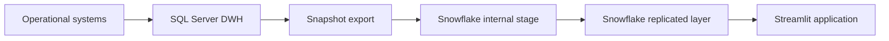

# Manufacturing Data Platform Case Study

This repository shows one larger data project that I built in stages, not three unrelated demos.

It started with a SQL Server warehouse for manufacturing and commercial data. Then I added a replication layer into Snowflake so the analytical model could live outside the on-prem environment. The next step is a Streamlit application on top of that replicated layer.

I like presenting it this way because it reflects the real work better. First I had to make the data model usable. Then I had to make it portable. Only after that did it make sense to think about an application.

## Project goal

The core problem was simple to describe and harder to solve well.

There was a lot of useful operational data, but most analysis still depended on local knowledge of source systems and ad hoc SQL. I wanted to turn that into something more stable:

- a warehouse with clear grain and repeatable refreshes
- a cloud-replicated analytical layer that is easy to operate
- and, in the next phase, an application that makes the data easier to consume

## The project in 3 parts

### 1. SQL Server DWH

This part covers the warehouse itself:
- source-aligned staging
- dimensions and facts
- ETL orchestration
- validation
- practical modeling decisions around history, grain, and messy source data

Start here:
- [`sql_server_dwh/README.md`](./sql_server_dwh/README.md)

### 2. Snowflake replication

This part covers the replication of the warehouse into Snowflake:
- snapshot export from SQL Server
- internal stage layout
- `COPY INTO` loading pattern
- refresh procedure
- key-pair authentication
- local automation for export, upload, and refresh

Start here:
- [`snowflake_replication/README.md`](./snowflake_replication/README.md)

### 3. Streamlit app

This is the application layer that sits on top of Snowflake. It is the last step in the same story: taking a modeled and replicated data layer and turning it into something business-facing.

Current placeholder:
- [`streamlit_app/README.md`](./streamlit_app/README.md)

## End-to-end architecture

```mermaid
flowchart LR
    A["Operational systems"] --> B["SQL Server DWH"]
    B --> C["Snapshot export"]
    C --> D["Snowflake internal stage"]
    D --> E["Snowflake replicated layer"]
    E --> F["Streamlit application"]
```

## What this repo is meant to show

This is not a "look, I know how to write one good SQL query" project.

What I actually wanted this repository to show is:
- how I think about turning source data into an analytical model
- how I make tradeoffs when the clean textbook option is not the best practical one
- how I move from on-prem data infrastructure into a cloud analytical layer
- and how those backend decisions connect to a user-facing application later on

## Repository structure

- [`architecture/`](./architecture/)
  Diagrams and model visuals.
- [`sql_server_dwh/`](./sql_server_dwh/)
  The warehouse subproject.
- [`snowflake_replication/`](./snowflake_replication/)
  The replication and automation subproject.
- [`streamlit_app/`](./streamlit_app/)
  The planned application subproject.
- [`docs/`](./docs/)
  Supporting warehouse documentation from the original case study.
- SQL examples now live inside the subprojects where they belong:
  - [`sql_server_dwh/sql_examples/`](./sql_server_dwh/sql_examples/)
  - [`snowflake_replication/sql_examples/`](./snowflake_replication/sql_examples/)
  - [`streamlit_app/sql_examples/`](./streamlit_app/sql_examples/)

## A note on the public version

This is a portfolio version, so I am intentionally leaving out anything that would turn it into a copy of an internal company environment.

That means no real connection details, no full production procedures, and no company-specific cleanup rules that would not teach anything useful outside the original setting.

What I am trying to keep visible is the part that matters for engineering review:
- structure
- decisions
- tradeoffs
- and how the project evolved from a warehouse into a broader data platform
