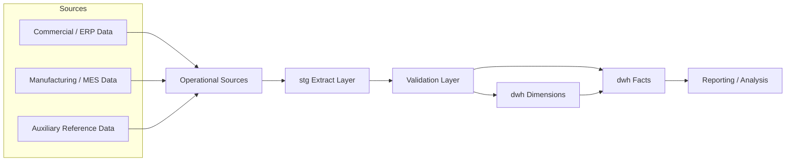
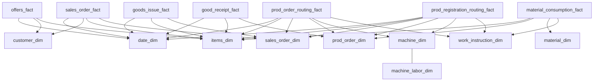

# SQL Server DWH

This is the first subproject in the larger manufacturing data platform case study.

It is the part where the warehouse itself was designed and implemented in SQL Server. The Snowflake and application work came later, but this layer had to exist first and had to be stable enough to trust.

Most of the supporting material for this subproject is still in the top-level `docs/` and `sql_examples/` folders. That is simply because this repository originally started as a warehouse-only case study, and I decided to preserve that work instead of rewriting everything just to make the folder tree look cleaner.

The text below is the original warehouse case study, with only light edits so it fits into the broader platform story.

## Original case study

This repository is a cleaned-up version of a real SQL Server data warehouse project I built around manufacturing and commercial data.

The main goal was to take operational data that was useful only to people who already knew the systems very well and turn it into something that could be queried and reported in a more stable, repeatable way. The hard part was not writing one good SQL query. It was figuring out grain, deciding where history mattered, separating source logic from analytical logic, and making the whole thing dependable enough to refresh every day.

I built the warehouse in a simple layered form:
- `stg` for source-aligned extracts
- `dwh` for dimensions and facts
- SQL Agent jobs for scheduled refresh
- lightweight validation between extract and transform

The source data came from a mix of commercial and production systems, so a lot of the work was around dealing with mismatched naming, mixed current-state and historical data, and business processes that looked simple until you tried to model them consistently.

## What is in the model

On the dimension side, the project includes things like:
- `date_dim`
- `customer_dim`
- `items_dim`
- `sales_order_dim`
- `prod_order_dim`
- `machine_dim`
- `material_dim`
- `work_instruction_dim`

On the fact side, it includes:
- offers
- sales orders
- goods issue
- goods receipt
- material consumption
- production routing plan
- production routing registrations

Some dimensions are handled as current-state only. Some use SCD2. That choice was not made mechanically. It depended on whether the history actually mattered in analysis and whether the source-side versioning was usable enough to trust.

## Architecture

## Simplified schema view

This is a simplified view of the target shape. The full working model was more detailed, but this is the general structure I worked toward.

## How the ETL works

The refresh is split into a few simple steps:

1. truncate staging
2. load staging
3. validate staging
4. transform dimensions
5. transform facts

That may not be the fanciest setup, but it is easy to understand, easy to debug, and good enough for a practical first production version.

## What I wanted to solve well

A few things mattered more than everything else:
- keeping source-shaped extraction separate from business-shaped modeling
- choosing the right grain for facts instead of forcing one too early
- being careful with historical lookups where dates actually matter
- making the warehouse resilient when source data is messy
- avoiding one-off report SQL every time the same business question came back

I also tried to keep the model practical. When a simple solution was enough, I used the simple solution. When a dimension really needed historical behavior, I modeled it that way. I was not trying to build the most complex warehouse possible, just one that would actually hold up in day-to-day use.

## Supporting files

- [`../docs/01-business-problem.md`](../docs/01-business-problem.md)
- [`../docs/02-source-systems.md`](../docs/02-source-systems.md)
- [`../docs/03-architecture.md`](../docs/03-architecture.md)
- [`../docs/04-dimensional-model.md`](../docs/04-dimensional-model.md)
- [`../docs/05-etl-orchestration.md`](../docs/05-etl-orchestration.md)
- [`../docs/06-data-quality-and-validation.md`](../docs/06-data-quality-and-validation.md)
- [`../docs/07-scd-decisions.md`](../docs/07-scd-decisions.md)
- [`../docs/08-lessons-learned.md`](../docs/08-lessons-learned.md)
- [`../docs/09-what-was-redacted.md`](../docs/09-what-was-redacted.md)
- [`../sql_examples/README.md`](../sql_examples/README.md)

## What is intentionally left out

This is a public portfolio version, so I left out anything that would effectively turn it into an internal company backup.

That includes:
- real connection details
- full production procedures
- customer-specific cleanup rules
- internal naming that would add no value outside the company

What I wanted to keep visible is the part that actually shows the work: the structure of the warehouse, the ETL approach, the modeling decisions, and the tradeoffs behind them.
